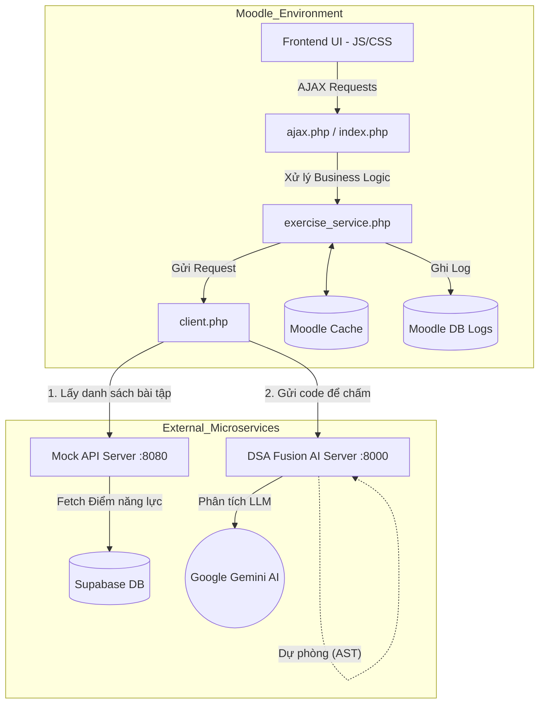

# Tổng Quan Kiến Trúc Hệ Thống AI Grader & Personalized Suggestion

## 1. Giới thiệu chung
Plugin `local_exercise_suggestion` là một module mở rộng của Moodle, cung cấp tính năng đề xuất bài tập cá nhân hóa và chấm điểm mã nguồn bằng Trí tuệ nhân tạo (AI). Hệ thống không hoạt động độc lập mà đóng vai trò là "Trạm trung chuyển" (Hub) liên kết giữa người dùng Moodle với các hệ thống Microservices bên ngoài.

## 2. Sơ đồ Kiến trúc Tổng thể

## 3. Các thành phần chính của Kiến trúc
1. **Frontend (Client-side):** Được viết bằng Vanilla JavaScript, nhúng vào Moodle thông qua cơ chế AMD (Asynchronous Module Definition). Giao tiếp hoàn toàn qua REST API nội bộ (`ajax.php`).
2. **Backend Moodle (PHP):** 
   - Đảm bảo tính bảo mật (kiểm tra `require_login()`, `sesskey`).
   - Xử lý cache (Cache TTL 300s - 3600s) giúp giảm tải hệ thống.
3. **Mock API Server (PHP thuần):** Xử lý thuật toán gợi ý bài tập. Đóng vai trò cầu nối với cơ sở dữ liệu phân tích học tập (Supabase) để truy xuất điểm số của sinh viên, từ đó quyết định độ khó bài tập phù hợp.
4. **DSA Fusion Server (Python/FastAPI):** Lõi AI của hệ thống. Nhận mã nguồn từ sinh viên, gửi lên Google Gemini để phân tích, chấm điểm và trả về nhận xét. Tích hợp cơ chế Fallback AST.

## 4. Đặc tả luồng dữ liệu (Data Flow)
- **Luồng 1 (Gợi ý bài tập):** User mở Modal -> Gọi `ajax.php` -> Service kiểm tra Cache -> Cache rỗng -> Gọi Mock API -> Mock API lấy điểm từ Supabase -> Ánh xạ độ khó -> Query CSDL bài tập -> Trả về danh sách -> Lưu Cache Moodle -> Hiển thị UI.
- **Luồng 2 (Chấm điểm):** User nộp code -> `ajax.php` -> Gọi thẳng DSA Fusion (không qua Cache) -> Fusion chấm AI/AST -> Trả về điểm số -> Lưu kết quả vào Moodle Cache bằng `submission_id` -> Cập nhật UI.
- **Luồng 3 (Xem kết quả):** Tự động đọc từ Moodle Cache dựa trên UUID của bài nộp. Nếu hết hạn (qua 5 phút), tự động gọi lại API để fetch kết quả.
