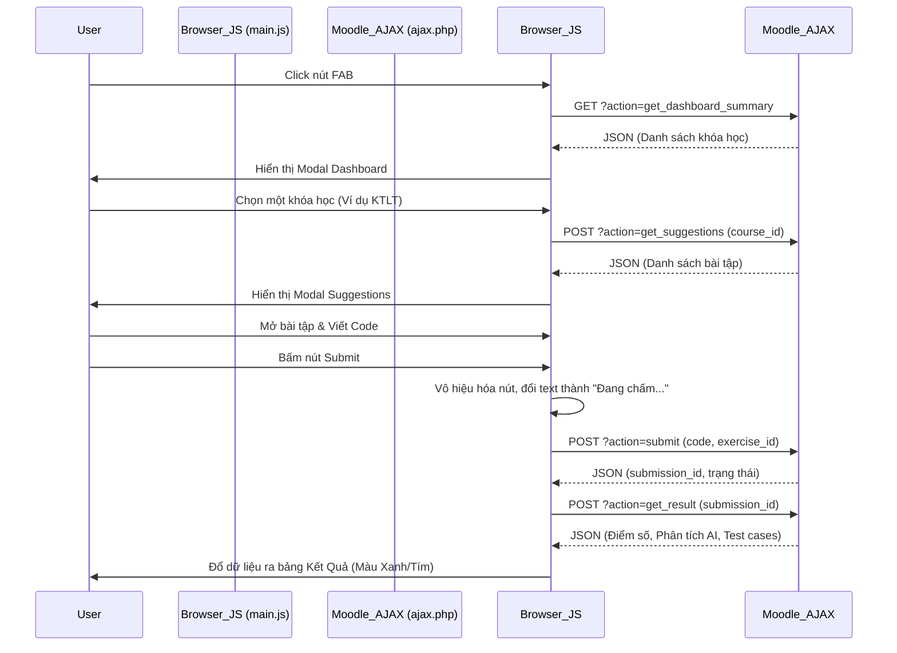

# Luồng Xử Lý Giao Diện Frontend (Client-side)

## 1. Công nghệ sử dụng
- **Moodle AMD Modules:** Hệ thống sử dụng kiến trúc AMD (RequireJS) chuẩn của Moodle để nạp file JS tĩnh (`amd/src/main.js` được biên dịch ra `amd/build/main.min.js`).
- **Vanilla JavaScript:** Không sử dụng jQuery để tối ưu hóa hiệu năng, thao tác DOM thuần.
- **CSS3 / UI UX:** Sử dụng các kỹ thuật giao diện hiện đại như Floating Action Button (FAB), Modals, Progress bars, và color mapping (Thẻ xanh/tím phân biệt điểm Local AI và Cloud AI).

## 2. Các thành phần giao diện chính
- **Nút FAB (Floating Action Button):** Một nút trôi nổi xuất hiện ở góc dưới bên phải màn hình khi người dùng ở trang Dashboard hoặc bên trong một khóa học. Nút này được tiêm (inject) động vào DOM.
- **Cửa sổ Modals:** Có 3 trạng thái Modal chính:
  1. *Dashboard Modal:* Hiển thị danh sách các khóa học mà sinh viên đang học.
  2. *Suggestions Modal:* Danh sách các bài tập được cá nhân hóa đề xuất cho môn học đã chọn.
  3. *Exercise Modal / Result Modal:* Hiển thị chi tiết đề bài, trình soạn thảo code, và cuối cùng là bảng điểm chi tiết từ AI.

## 3. Sơ đồ tuần tự (Sequence Diagram) - Frontend

## 4. Xử lý logic và bảo vệ người dùng
1. **Debounce / Tránh Spam:** Khi người dùng bấm nút Nộp bài, giao diện ngay lập tức khóa nút bấm để tránh việc gửi đi gửi lại nhiều request (Spamming), bảo vệ server AI khỏi quá tải.
2. **Xử lý lỗi mạng:** Trong hàm `fetchAPI` của JS, nếu server Moodle trả về HTTP Status ngoài `200-299`, JS sẽ bắt lỗi (catch error) và hiển thị một thông báo thân thiện lên màn hình thay vì làm "treo trắng" Modal.
3. **Hiển thị thông minh (Conditional Rendering):** Tùy vào việc sinh viên đang đứng ở đâu:
   - Đứng ở trang chủ (Dashboard): Nhấn FAB sẽ hiện danh sách tất cả các môn.
   - Đứng ở trong một môn học: Nhấn FAB sẽ bỏ qua bước chọn môn và đi thẳng vào danh sách bài tập của môn đó.
